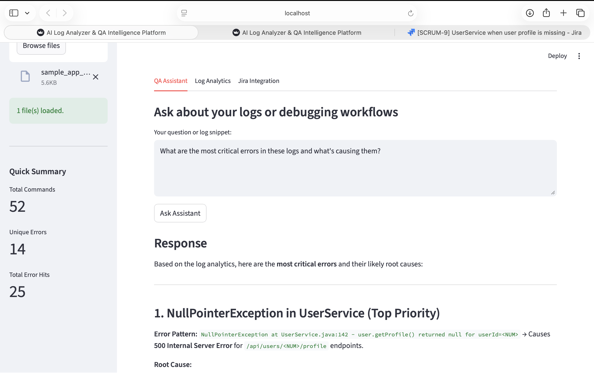
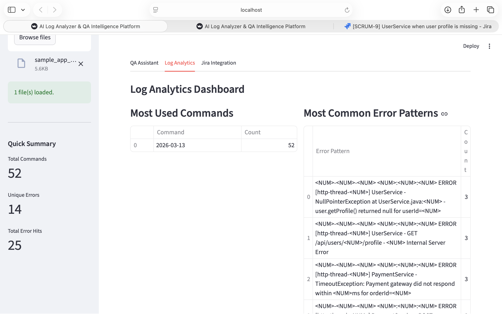
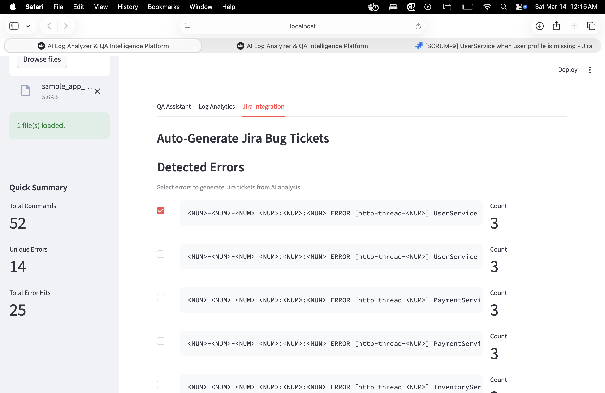
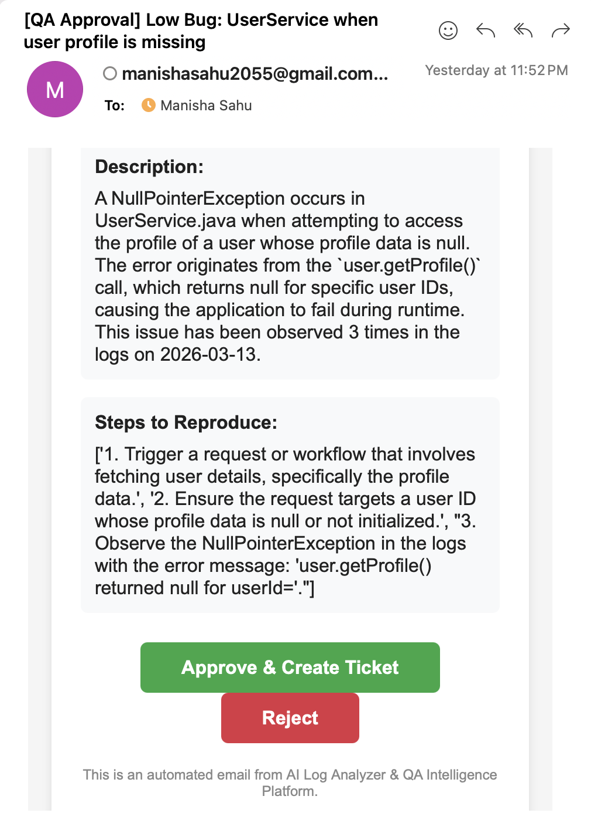
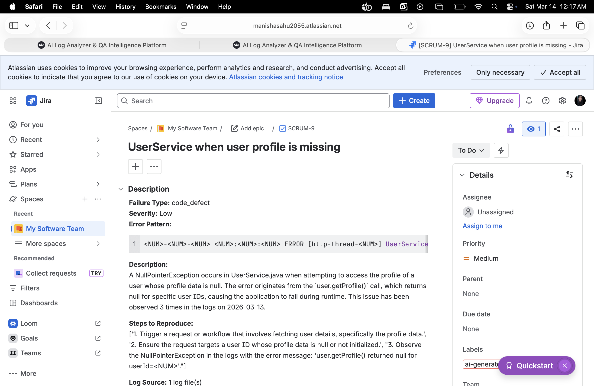
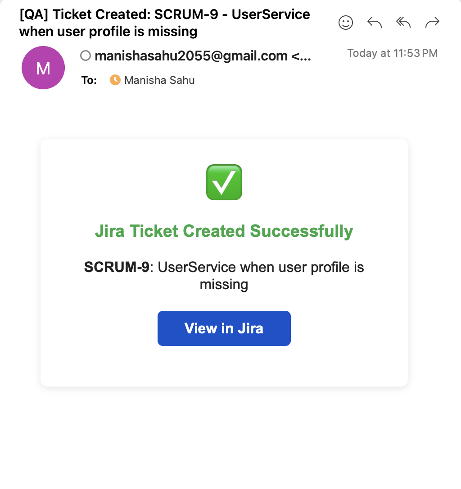

# log2jira

AI-powered log analysis and QA intelligence platform that automates the entire triage workflow. Upload CI/CD or application logs and the system detects error patterns, classifies failures into categories like environment issues, code defects, flaky tests, and data problems, then generates complete bug reports. Managers get an email to approve each ticket, and once approved, it auto-creates the Jira issue with a direct link. Built with Mistral AI, LangChain, Jira REST API, and SMTP.

**Live App:** [ai-assistant-intelligence.streamlit.app](https://ai-assistant-intelligence.streamlit.app/)

---

## The Problem

QA engineers spend hours manually reading through CI/CD and application logs, identifying errors, classifying them, writing bug reports, and creating Jira tickets. This process is repetitive, slow, and error-prone — especially when dealing with thousands of log lines across multiple files.

## The Solution

This platform uses LLM-powered analysis (Mistral AI + LangChain) to automate the entire QA log triage workflow:

1. **Upload logs** — drag and drop CI/CD or application log files
2. **AI analyzes** — automatically detects error patterns, clusters recurring failures, and maps command-error co-occurrences
3. **Generate bug tickets** — AI auto-classifies each error (environment, code defect, flaky test, data issue) and generates complete bug reports with title, description, severity, steps to reproduce, and suggested assignee
4. **One-click Jira integration** — sends tickets to the QA manager via email for approval. On approval, the ticket is auto-created in Jira via REST API
5. **Confirmation** — manager receives a confirmation email with a direct link to the Jira ticket

---

## Features

### QA Assistant (Chat)
- Ask natural language questions about your logs
- Get AI-powered root-cause analysis and debugging suggestions
- Paste error snippets and get instant explanations
- Failure classification into categories: environment, code defect, flaky test, data issue

### Log Analytics Dashboard
- Automatic error pattern detection and clustering
- Command frequency analysis
- Command-error co-occurrence mapping
- Error examples with expandable details
- Quick summary metrics in sidebar

### Jira Integration with Email Approval
- AI auto-generates fully populated bug tickets from detected errors
- Inline editing of ticket title and severity before submission
- Email sent to QA manager with Approve/Reject buttons
- On approval, ticket is auto-created in Jira via REST API
- Confirmation email with direct Jira link sent after ticket creation
- Pending approval tracking in the dashboard

---

## Screenshots

### QA Assistant - AI Chat


### Log Analytics Dashboard


### Jira Integration - Generate Tickets


### Email Approval Request


### Ticket Created in Jira


### Confirmation Email


---

## Tech Stack

| Layer | Technology |
|-------|-----------|
| Frontend | Streamlit |
| AI/LLM | Mistral AI, LangChain |
| Log Parsing | Python, Regex, NLP |
| Issue Tracking | Jira REST API |
| Email | SMTP (Gmail) |
| Deployment | Streamlit Community Cloud |

---

## Setup & Installation

### Prerequisites
- Python 3.10+
- Mistral AI API key
- Jira account with API token
- Gmail account with App Password enabled

### Local Setup

```bash
# Clone the repository
git clone https://github.com/manishasahu271/ai-assistant.git
cd ai-assistant

# Create virtual environment
python -m venv venv
source venv/bin/activate  # Mac/Linux
# venv\Scripts\activate   # Windows

# Install dependencies
pip install -r requirements.txt

# Create .env file
cp .env.example .env
# Edit .env with your actual API keys

# Run the app
streamlit run app.py
```

### Environment Variables

Create a `.env` file in the project root:

```
MISTRAL_API_KEY=your_mistral_api_key
JIRA_SERVER=https://your-domain.atlassian.net
JIRA_EMAIL=your-email@gmail.com
JIRA_API_TOKEN=your_jira_api_token
JIRA_PROJECT_KEY=SCRUM
SMTP_SERVER=smtp.gmail.com
SMTP_PORT=587
SMTP_EMAIL=your-email@gmail.com
SMTP_PASSWORD=your_gmail_app_password
MANAGER_EMAIL=manager@company.com
APP_BASE_URL=http://localhost:8501
```

---

## How It Helps QA Teams

| Before (Manual) | After (AI Log Analyzer) |
|---|---|
| Read through 1000s of log lines manually | AI identifies errors in seconds |
| Manually classify each error | Auto-classified into 4 categories |
| Write bug reports from scratch | AI generates complete bug reports |
| Copy-paste into Jira manually | One-click Jira ticket creation |
| Email back and forth for approvals | Manager approves directly from email |
| Hours per triage cycle | Minutes per triage cycle |

---

## License

This project is open source and available under the [MIT License](LICENSE).
